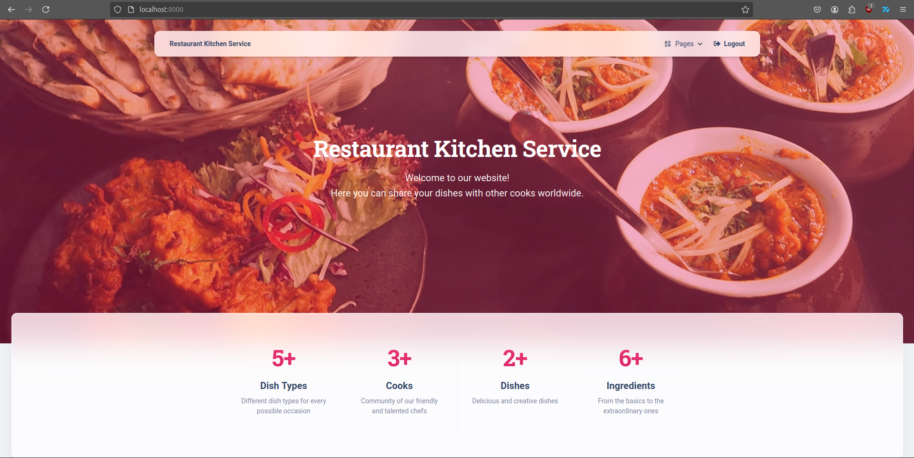

# Restaurant Kitchen Service
> Cooks' helping website in managing their dishes

The whole purpose of the website is to allow cooks to make managing their dishes easier. They can create different
dish types and ingredients, that will be linked to the dishes they create on the website. For example, one could create
Pasta Carbonara and choose which dish type it is, and which ingredients it uses. Also, it's possible to create new
cooks and view their profiles. Actually, you can create, update and view anything!

## Check it out!

[Link to the rendered website]

You can log in with these credentials:

username: test.cook
password: cookING.01

## Installing

If you want to launch my project on your device, here are the steps. However, mind that Python3 should already be
installed.

```shell
git clone https://github.com/raychw/restaurant-kitchen-service/
cd restaurant_kitchen_service
python3 -m venv venv
source venv/bin/activate
pip install -r requirements.txt
python manage.py runserver
```

### Features

* Authentication functionality for Cook/User.
* Easy management of Dish types, Dishes, Cooks, and ingredients.
* Powerful admin panel for advanced managing.
* User-friendly interface.


## Demo



## Licensing

The back-end of this code is fully written by myself, but front-end is taken from the free Django Material Kit.
Check them out here:
https://appseed.us/product/material-kit/django/
